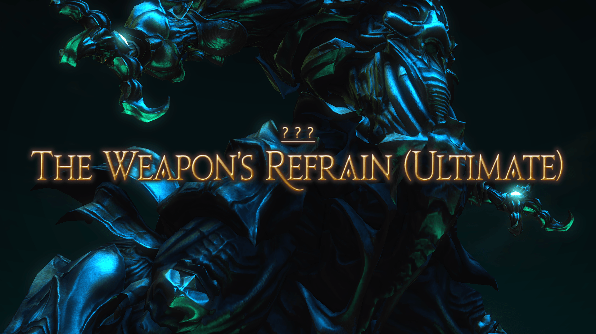
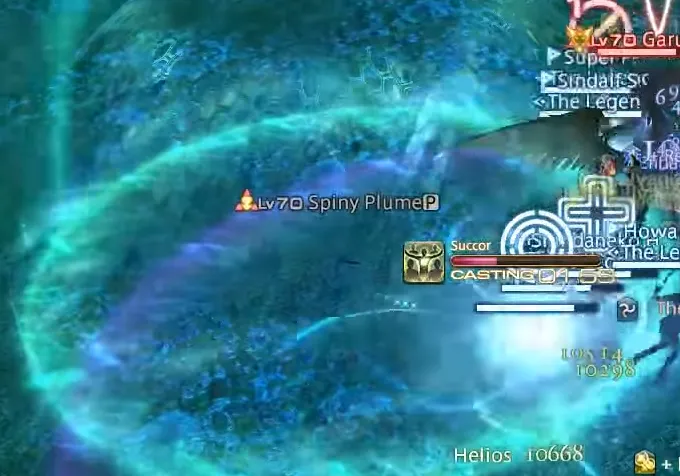
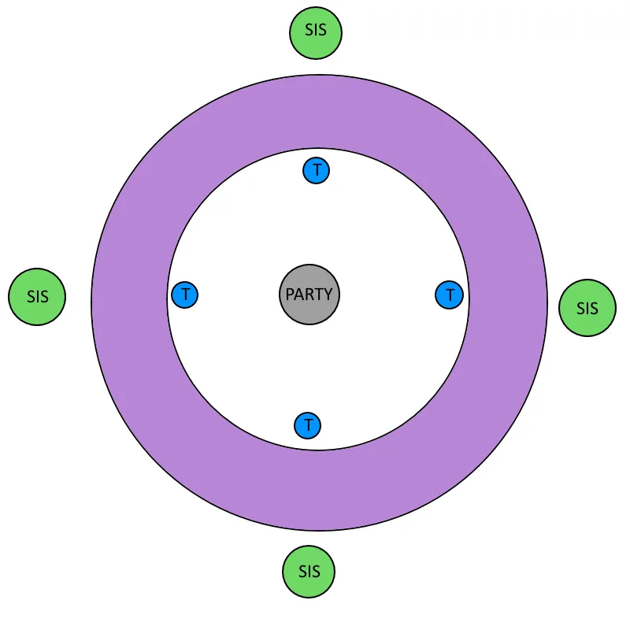
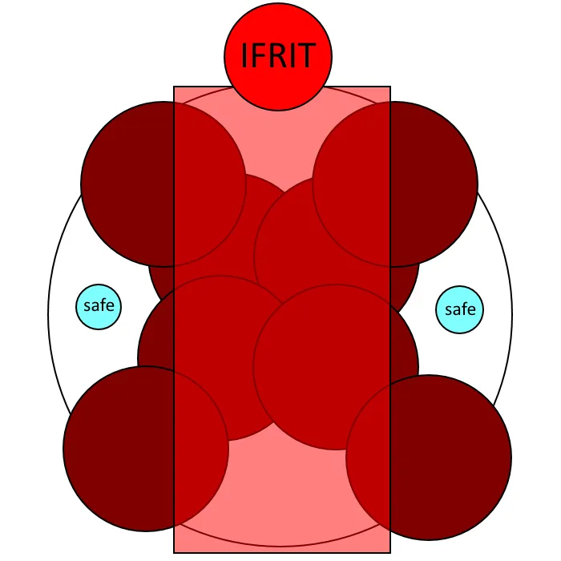
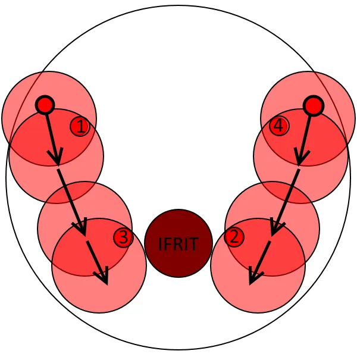
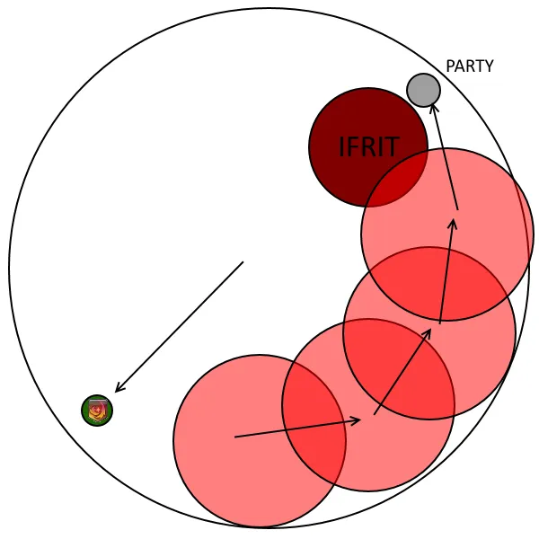
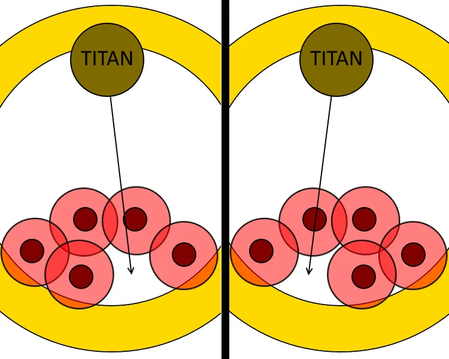
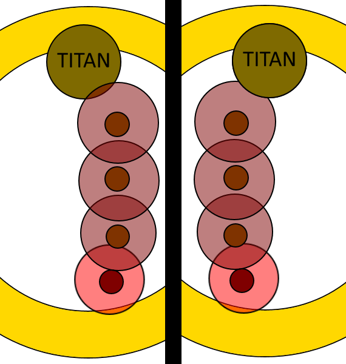
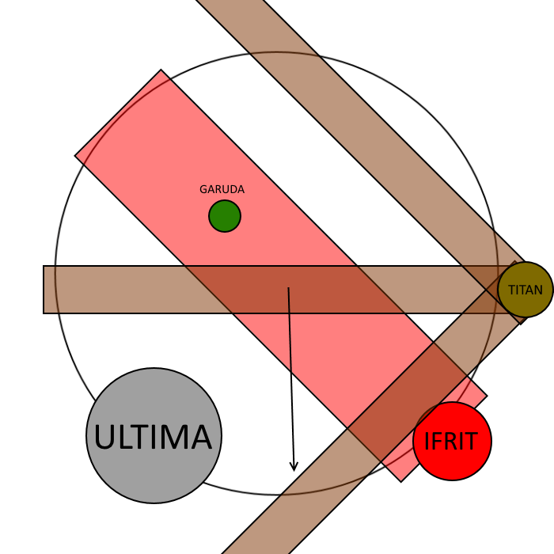
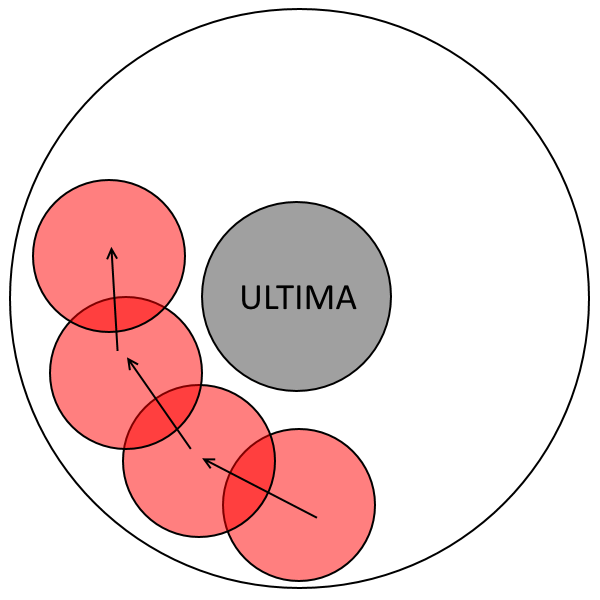

+++
title = "UWU"
+++

# The Weapon's Refrain (Ultimate)

The Weapon's Refrain (Ultimate), also called Ultima Weapon
(Ultimate), is a high-end duty added in patch 4.31: Under the
Moonlight. The fight can be unlocked by speaking to the Wandering
Minstrel in Kugane ( 11.6, 12.6 ) after completing Sigmascape V4.0
(Savage).

The minimum ilvl to enter this fight is i370, but can be bypassed with a full party.

> A few disclaimers:
> * This fight's design was seemingly made to be
done blind. If possible, I'd recommend foregoing reading any guide and
progressing through this fight blindly, coming up with your own
strategies (although I know it's difficult in the internet era). Feel
free to send me a message if you find something you think might be
better than explained below!
> * The arena is constantly surrounded by a wall that will kill you if you step inside it.
> * Both a caster DPS (BLM, RDM, SMN) and a melee DPS (DRG, NIN, MNK, SAM) are **REQUIRED** in order to finish the fight. Plan accordingly.
> * There are multple mechanics earlier in the fight that will affect
how you proceed with the encounter later on (i.e. Thermal Low stacks on
certain players needed for later phases, Ultimate Annihilation orbs
affecting Aetheric Boom, etc). Therfore, it's important for some
strategies to plan assigned players ahead in advance, so I'd recommend
reading through the whole guide before deciding on a strategy for your
team.
> * The outlined strategies are not claimed to be the
 only way to do this fight. They are simply what seemed to work best
during progression, and different strategies will work better with other
 groups.

# Three Primals

## Woken

Whenever certain mechanics are performed in specific ways (depending
on the boss), the three primals will gain stacks of "Aetherically
Charged," which can be seen on their buff bar. Once they reach their
fourth stack, they will gain the "Woken" status, glow with a blue aura,
gain new abilities, and change how other abilities function. When a
 primal is defeated with the "Woken" status, they will drop behind a
pillar of light on the arena. When a player steps inside this pillar, it
 will disappear and they will obtain the status "Beyond Limits." This
buff completely fills your Limit Break gauge when a Level 3 Limit Break
is used by that person. This is required to progress past the three
primals, so keep that in mind.

## Phase 1: Garuda
### Garuda's Abilities
* **Slipstream**: Frontal
 cleave with a 2.5s cast time dealing significant magical damage and
inflicting a stun. As Garuda stands still during this cast, it can be
avoided by moving away from her front. Consider it an unmarked cone AoE
that should be avoided.
* **Mistral Song**: A
 green marker will be placed on a healer. Garuda will then turn around,
face the target, and fire off a line AoE in that direction dealing heavy
 magic damage. Must be mitigated by having a tank stand in front of
Garuda, and taking the first hit. Garuda then will summon a cyclone
under where the first player in line was hit.
* **Downburst**: Heavy physical tankbuster with no cast time that cleaves. When **Woken**, becomes a split tankbuster that the whole party can soak.
* **Feather Rain**: Garuda
 will shriek loudly, jump in the air, and spawn multiple small circle
AoEs under players. Being hit by these will deal heavy magic damage and
apply a "Windburn" dot, dealing massive damage (almost 14k a tick!) for
18s.
* **Aerial Blast**: Raid buster dealing massive magical damage to all players.
* **Friction**: Garuda
 will face a random player and hit them with small splash AoE dealing
magic damage. Inflicts a stack of Thermal Low to all players hit.
* **Eye of the Storm**: The
 outer ring of the arena will glow purple to signify a cyclone appearing
 on the edges of the arena. Stepping on the edge when this cyclone is
active will deal lethal magic damage.
* **Wicked Wheel**: Small circle AoE dealing lethal physical damage to all players in melee range.
* **Wicked Tornado**: Instant raid-wide AoE dealing lethal magic damage. 
Only appears when Garuda is
Woken and immediately after Wicked Wheel. There are two safe spots: one
in melee range and one very far from Garuda.

Begin by pulling Garuda to the edge of the arena. Shortly after, she will immediately begin with a **Slipstream** and mark a random healer for **Mistral Song.** Make sure to have a tank in between Garuda and the healer as shown below.

*You can also forego all healer movement and just have the tank stack in
front of the party, with the marked player in the party stack, but this
will result in significantly more damage on the raid. You also have the
option of simply using Cover on the healer, if you have a Paladin in
your party.*

Garuda will follow up with a second Slipstream, followed by a **Downburst**, and spawn 4 **Satin Plumes**, tethering to random DPS; and 1 **Spiny Plume**,
 which will tether to the first person to attack it. If left alone,
Satin Plumes will explode, inflicting all players with a sleep, meaning
they must be killed as soon as possible. Make sure to group up and AoE
them down. Have your tank pick up the Spiny Plume as soon as possible.
The Spiny Plume, on the other hand, will periodically cast **Cyclone**
on the tank, dealing significant magic damage and inflicting a stack 
of **Thermal Low**.

Before killing this Spiny Plume, it is very important that your tank
takes two hits of Cyclone in order to gain two stacks of Thermal Low.
While you're fighting plumes, Garuda will use **Feather Rain**. Make
 sure you listen for her scream, which will indicate when you'll have to
 move to avoid it. She'll immediately follow up with a Mistral Shriek.

> Note: Thermal Low persists through death, so don't worry about having people with the buff dying if you can rez them in time.

### Super Cyclone

*Bubble left behind by Spiny Plume shown above.*

When the Spiny Plume is defeated, it will use **Gigastorm**,
 exploding for a small AoE circle around it, and leaving behind a large
green bubble. Stepping inside this bubble will give players **Thermal High**
 (heavily reducing all wind damage), dispel any Thermal Low stacks, and
deal magic damage to the raid corresponding to the number of stacks in
the form of **Super Cyclone** (1 stack will deal small
 magic damage, 2 stacks will deal significantly more magic damage, and 3
 stacks will deal lethal magic damage that will wipe the raid). It's
important to note that **whenever a player dispels 2 stacks of Thermal
Low, Garuda will gain a stack of Aetherically Charged.**

Garuda will then follow up with two **Frictions**, targetting random
players, and splashing everyone hit for damage and inflicting stacks of Thermal Low.

Here's a step-by-step guide of how I'd recommend dealing with Thermal Low Stacks:

* Pre-assign 3 DPS to gain 2 stacks of Thermal Low. Two of these
people will be cleansing their stacks via the puddle, and the third will
 cleanse their stacks via Mesohigh tethers. **Make sure you carefully
choose these players, as your remaining players with 1 stack will be in
charge of mechanics in the Ultima phase, specifically Ultimate
Annihilation and Ultimate Suppression.** I'd recommend
pre-assigning your DPS to have 2 stacks, leaving your healers and tanks
to have 1 stack each when Garuda is killed.
* Have a tank recieve two Thermal Low stacks from the Spiny Plume, and
immediately defeat it while avoiding Feather Rain.
* Heal up after Mistral Shriek, and have your tank with two stacks run
 into the puddle. Garuda should now have 1 stack of Aetherically
Charged.
* For the first Friction cast, have your whole party stacked for
Friction, with your 3 pre-assigned players standing outside the bubble,
and the rest of the party inside. Your 3 players should have 1 stack.
* For the second Friction cast, have your whole party stacked for
Friction, with everyone outside the bubble. You should have 3 players
with 2 stacks, and the rest of the party with 1 stack.
* Have 2 of your DPS (preferably melee DPS) move into the bubble,
cleansing their stacks. Make sure to leave ample time for your healers
to heal damage done by Super Cyclone in between each feed. Garuda should
 now have 3 stacks of Aetherically Charged.

If done correctly, you will have 5 players with 1 stack of Thermal Low, and
1 player with 2 stacks of Thermal Low.
> Note:
 It is possible to wake up Garuda before Mesohigh tethers, during the
Spiny Plume bubble, by having the third person with 2 stacks of Thermal
Low walking into the bubble. However, I wouldn't recommend this, as it
both makes an already difficult healing phase even harder, and
introduces extra mechanics which don't have to be seen in order to clear
 the fight.

Garuda will follow up with an Eye of the Storm, and summon **Chirada**
and **Suparna** (aka **Sisters**),
 untargettable adds that have similar skills to Garuda. After being
summoned, they will immediately use Feather Rain (remember to listen for
 the scream!) and mark a DPS and healer with Mistral Song, jumping to
the edges of the arena. Sisters will always jump to two of the four
cardinal points of the arena. Drag Garuda to the wall as you dodge
Feather Rain so you don't have to worry about Wicked Wheel, which she
will cast next. Have your party stack directly in the middle, with tanks
 in front of each sister (but not at the edge, as Eye of the Storm will
be active) to intercept the first hit of Mistral Song. I'd recommend
having one tank take the first sister going clockwise starting from
northwest, and the other tank taking the first sister going
counter-clockwise starting from northwest. Remember tornadoes will spawn
 under the first hit players, so you may have to reposition the party to
 avoid them.

*Only two sisters will appear. This diagram shows all 4 possible locations
for sisters to spawn. Purple indicates Eye of the Storm, which is an
unsafe area.*

After tornadoes resolve, drag Garuda back to the middle, as she will use another
**Eye of the Storm**. She will then summon another set of 4 **Satin Plumes**,
 so burn them quickly as you did in the start of the fight. At the same
time, the two sisters will appear in the east and the west sides of the
arena and tether random players with **Mesohigh**,
dealing heavy magic damage that must be mitigated with at least 1
Thermal Low stack. I'd recommend having your last DPS with 2 stacks and a
 DPS with 1 stack (preferably ranged), while the party stacks together
defeating Satin plumes, and the tanks take a Downburst together. You can
 have the entire party stack together for Downburst if you wish. If
you've been following the outlined strategy, and your last 2 stack
Thermal Low player takes a tether, these tethers will give Garuda her
final Aetherically Charged stack, making her "Woken."

*Yellow dots indicate the players who will be taking the tethers.
Alternatively, if you want your tanks to take these tethers, you can
rotate the diagram and have Garuda face east or west, with the other
tank taking the other tether.*

As soon as Mesohigh tethers resolve, the sisters will shriek and jump
 once more, using Feather Rain, followed by Garuda using another
Slipstream. Garuda will then follow up with a Wicked Wheel into Wicked
Tornado combo, as she is woken. Make sure to avoid the wheel first, and
then move into melee range as soon as the marker disappears, as Wicked
Tornado has no cast time. She will follow up with a woken Downburst,
which must be taken by at least both tanks as a split tankbuster. She
will then use a final Slipstream, before enraging.

At 2:55, Garuda will become untargettable, jump in the air, and use a
 Feather Rain followed by a lethal Aerial Blast, serving as an enrage.

If this phase was done as described, you should be defeating Garuda
with 4 players having 1 stack of Thermal Low (your tanks and healers),
of which 3 you will need in later phases of the Ultima Weapon. After
defeating Garuda when she is Woken, a light puddle will appear where she
 is defeated. Make sure either a healer, caster, or melee picks up this
puddle.

> There is an alternative strategy, in which a tank and healer does
Mesohigh tethers. This does have merit, as it makes sure all feathers
are stacked together during Mesohigh, and allows the tank to keep uptime
 during **Ultimate Annihalation** in a later phase.
> I'm sadly not 100% informed on this strategy, so I don't fully
understand how you'd deal with later phases, but it does work. I'll
hopefully have a full write-up on this strategy later, as it's strongly
advocated by multiple players.

> **Rotation**
> * Slipstream
> * Mistral Song
> * Satin Plume x4 + Spiny Plume Spawn
> * Slipstream
> * Downburst
> * Feather Rain
> * Mistral Shriek
> * Friction
> * Friction
> * Feather Rain
> * Aerial Blast
> * Sisters Spawn
> * Feather Rain (Sisters)
> * Eye of the Storm + Mistral Song x2
> * Wicked Wheel
> * Feather Rain
> * Satin Plume x4 Spawn
> * Eye of the Storm
> * Slipstream
> * Mesohigh x2 + Downburst
> * Feather Rain
> * Slipstream
> * Wicked Wheel + Wicked Tornado
> * Downburst
> * Slipstream
> * Feather Rain
> * Aerial Blast (Enrage)

## Phase 2: Ifrit
### Ifrit's Abilities:

* **Radiant Plume**: Large
 red circles will appear in the arena, in different configurations,
which will then explode in a pillar of flames after 4 seconds. Standing
on these circles when they explode will result in lethal magic damage.
* **Crimson Cyclone**: Ifrit
 will jump outside the arena and will begin to charge up for 3 seconds.
Afterwards, he will dash across the arena in a straight line, dealing
lethal magic damage to all players hit. When **Woken**,
 this charge leaves behind an afterburn in the shape of a cross 45
degrees off from the woken charge, dealing lethal magic damage to all
players hit.
* **Hellfire**: Raid buster dealing massive magical damage to all players.
* **Vulcan Burst**: AoE
 covering a large radius around Ifrit dealing small magical damage
(approximately 5-5.5k damage) but a very large knockback. When shielded
so that the attack does 0 damage, knockback does not apply.
> In
 order to consistently shield Vulcan Burst, make sure to pair up an AoE
shielding ability (Aspected Helios/Succor) with at least 1 healing
cooldown.
* **Incinerate**: Tankbuster dealing heavy fire-aspected darkness damage
to its target, and inflicting a Fire Resistance Down II debuff.
* **Infernal Fetters**: A random DPS and the player second in enmity 
(usually a tank) will be tethered together, both being applied with
an **Infernal Fetters**
 debuff, reducing damage done and inflicting a menial DoT. Moving far
from each other will increase it's stacks. The more stacks inflicted,
the more severe the damage down and dot applied.
* **Inferno Howl**: Ifrit
 turns around and faces a healer and inflicts Searing Wind on them for
18s. Healers with this debuff will periodically explode with an AoE
similar to Vulcan Burst, but dealing significantly more damage. Searing
Wind will still explode even if the player who has the buff is
incapacitated. When **Woken**, Searing Wind has a 30s duration.
* **Eruption**: Red
 markers appear under players, which will then explode after 2.5s,
dealing lethal magical damage. Can usually be baited by the furthest
players from Ifrit.
* **Flaming Crush**: Ifrit
 will target a random DPS with a red triangle marker over their head.
Ifrit will then aim a fireball at that person and hit them with a split
AoE that must be shared. When **Woken,** Flaming Crush inflict **Accursed Flame**,
 a heavy DoT (10k/tick), on all players hit, with the duration of the
DoT decreasing the more players hit. A 6 player stack will result in
only a 3s duration, but a player taking it alone will have a duration
greater than a minute. This DoT persists through death. On six people,
the fireball does about 30k with no extra dot ticks.

After Garuda is defeated, Ifrit will appear at random cardinal, and begin
charging across the arena via **Crimson Cyclone**. At the same time, the
entirety of the arena will be covered in **Radiant Plumes**, leaving
only 1 of 2 possible safe spots at the perpendicular cardinals of the
arena, as shown in the following diagram. Stack in the middle of the
arena, look for the safe spot as soon as the plumes appear, and sprint
to it.  It is possible to time your dodge so you slide in to safe
spots covered by Ifrit's Crimson Cyclone, but it's more trouble than
it's worth.

*Only
 one of the two marked spots in the diagram will be safe. Make sure
where you're running is safe before you sprint there, as if you double
back you'll likely die to Radiant Plumes.*

Ifrit will then land and begin casting **Hellfire, **following up immediately with a **Vulcan Burst**.
 Make sure this is shielded to avoid being knocked into the wall. Ifrit
does not share an enmity table with Garuda, so your tanks need to grab
enmity as soon as possible. Ifrit will then follow up with three **Incinerates**, which
 can either all be taken by a single tank with invulnerability CDs, or a
 tank swap in between each cleave (i.e. tank A gets hit by 1 cleave,
tank B provokes and gets hit by the second, and tank A provokes back and
 gets hit by the third). After a short pause, Ifrit will then summon
four nails.

### Infernal Nails

*Keep
 in mind nails will not always be in this exact position, so you may
have to rotate in order to make your position match this diagram.*

While the positions of **Infernal Nails** is random,
they will always spawn in the same formation of two close nails, and two
 far nails, as shown in the following diagram. When an Infernal Nail is
destroyed, it will explode for raid wide damage in the form of
**Infernal Surge**, dealing
 moderate magic damage and inflicting a 1s stacking Vulnerability Up,
preventing players from destroying multiple at the same time. When an **Eruption**
 puddle hits a nail, the nail will grow in size, gaining a stacking
Vulnerability Down (~10% damage down per stack) and Damage Up buff. When
 a nail with 2 of these stacking buffs explode, not only will the
Infernal Surge result in doing more damage, but Ifrit will also gain a
stack of **Aetherically Charged**. In order to give
Ifrit the Woken status, all four nails must be destroyed when they have
been hit with 2 Eruptions, thus having 2 stacks of Damage up and
Vulnerability Down. The order that Infernal Nails are destroyed will
determine the order of Ifrit's Crimson Cyclone charges in a later phase
(i.e. the first Crimson Cyclone comes from the same location as the
first nail that was killed).

Drag Ifrit in-between the closer nails as shown in the diagram. Very
shortly after summoning nails, Ifrit will target a random healer with
**Infernal Howl**. Have this healer run to the back of the room, as close
to the wall opposite Ifrit as possible. Ifrit will then use
**Infernal Tethers**, tethering the off-tank and a random DPS
together, and begin casting **Eruptions** on
 the two furthest players from Ifrit. Make sure that at least two
Eruptions hit every nail, in order to successfully wake Ifrit. Bait
Eruptions like shown below:

*Not
 100% to scale, but make sure that your first two eruptions hit the
first nail on your side, and the last two eruptions hit the second nail
on your side. Also on this diagram is the recommended kill order for
nails.*

Kill the nails in the order shown above in order for Crimson Cyclones
 to dive in line, easy to dodge by moving counter-clockwise in a later
phase. **Make sure you remember the location of the last nail
 you killed, as this will be where you begin the second set of Crimson
Cyclones.** I'd recommend putting a waymark down to make it easy to remember.

When all nails are defeated, Ifrit will jump to the center of the
arena and use another Hellfire, following up shortly by using Infernal
Howl on a random healer, and immediately following up with Eruption. As
this Infernal Howl is woken, the Searing Wind debuff will have a longer
duration, so be wary. After Eruptions resolve, Ifrit clones will dash
along the arena through the cardinals. In order to deal with this, have
your current tank pull Ifrit toward the SW edge of the arena as soon as
Hellfire resolves. Have two pre-assigned (preferably ranged) players
stand near the back of the arena, ready to bait Eruptions along the wall
 toward the SW edge of the arena. The goal is for these players to end
in the same place as the party, already in a safe spot to dodge
eruptions. Your healer with Searing Wind should move toward the NE edge
of the arena as soon as possible. This movement should look something
like shown below:

*Your Eruptions should be baited at a cardinal ~135
degrees away from the stack point. Bait all 4 Eruptions along the wall
before stacking. At the same time, make sure your Searing Wind Healer
moves into position.*

*Have your Eruption baits stack with the rest of the party, and you're
done! Ifrit doesn't cleave here, so don't worry about standing in front of him.*

<button aria-label="Previous" class="glider-prev">«</button>
<button aria-label="Next" class="glider-next">»</button>

As soon as this movement is over, Ifrit will use Infernal Howl once
more on the other healer. For a short while, you will have two
Searing Winds in the arena, so be wary. I'd recommend having this healer
 move to one of the two free intercardinals. While both Searing Winds
are out, Ifrit will mark a random DPS with **Flaming Crush**. Make
 sure everyone (aside from the healers) is stacked  for this
fireball. A targeted Deployment Tactics Adloquium or Cure III works
wonders. One of your Searing Winds should wear off here.

Immediately after, Ifrit will jump, and spawn 3 other clones of
himself along the arena, in a formation identical to the nails in
earlier phases. One of these charges will be a Woken Ifrit, which
means it will leave behind an afterburn ~3s after he charges. If the
woken Ifrit charges from cardinal to cardinal, the afterburn will be on
the intercardinals. If the woken Ifrit charges from intercardinal to
intercardinal, the afterburn will be on the cardinals. The goal is
essentially to dodge charges in a way where you end up in either a
cardinal, or intercardinal point depending on where the woken Ifrit is.

Start at the position of the fourth Crimson Cyclone (except for your
Searing Wind healer, who should be opposite this location. If the nails
were killed in the knot order shown previously, the charges will
essentially be dodged if you just run into where charges resolve, in a
clockwise direction. Simply just dodge clockwise, away from the fourth
dive (and into the location of the first dive), and continue dodging
until you reach a cardinal/intercardinal, depending on the location of
the woken Ifrit charge. Your Searing Wind healer will be doing the same
dodge, albeit from the opposite location of Ifrit.

*Safe spots are interchangable. The Woken ifrit
appears at a random position, so be wary of it. This diagram is based on
 an intercardinal woken Ifrit.*

*Start dodging into the charges, moving clockwise. Stop on a cardinal or intercardinal depending on the woken Ifrit.*

*Have your Eruption baits stack with the rest of the party, and you're
done! Ifrit doesn't cleave here, so don't worry about standing in front of him.*

*Final afterburn & position if the woken Ifrit was on an intercardinal.*

*Final afterburn & position if the woken Ifrit was on a cardinal.*

<button aria-label="Previous" class="glider-prev">«</button>
<button aria-label="Next" class="glider-next">»</button>

Ifrit will then land in the middle of the arena, and shortly follow
up with another 3 Incinerates. Deal with these the same way as earlier
in the phase, Ifrit will then use another Eruption, targeting the
furthest two people. Ifrit will then use another Flaming Crush (all 8
players can stack for this one), enraging shortly after.

At 2:45 after the phase begins, Ifrit will become untargetable and use a 
lethal Hellfire, serving as an enrage.

After defeating Ifrit when he is Woken, a light puddle will appear
where he is defeated. Make sure either a healer, caster, or melee picks
up this puddle. Make sure to wait before picking up this puddle though,
as Titan will land on the ground with **Geocrush** very shortly after Ifrit is defeated, likely killing anyone that's not right at the wall.

> **Rotation**
> * Crimson Cyclone + Radiant Plumes
> * Hellfire
> * Vulcan Blast
> * Incinerate x3
> * Infernal Nail x4 Spawn
> * Inferno Howl
> * Eruption x2
> * Hellfire
> * Inferno Howl
> * Eruption x2
> * Crimson Cyclone (Cardinals)
> * Inferno Howl
> * Flaming Crush
> * Crimson Cyclone x4 (Woken)
> * Incinerate x3
> * Eruption x2
> * Flaming Crush
> * Hellfire (Enrage)

## Phase 3: Titan
### Titan's Abilities:

* **Geocrush**: Titan
 will rotate and face a cardinal direction, and proceed to jump to the
edge of the arena in that direction. Deals heavy magic damage based on
proximity from his impact point.
* **Earthen Fury**:  Raid buster dealing massive magical damage to all players.
* **Rock Buster**: Tankbuster with no cast time dealing heavy physical damage to
its target. Cleaves. This attack is always followed up by a **Mountain Buster**.
* **Mountain Buster**: Tankbuster with no cast time dealing severe physical
damage to it's target. Cleaves.
* **Weight of the Land**: Ground AoE appearing under random players twice in a
row, which then explode. When **Woken**, ground AoEs appear three times in a row.
* **Upheaval**: 3s cast knocking back all players from Titan's position.
* **Rock Throw**: Titan
 will throw rocks down on the arena. If a player is below where these
rocks spawn, they'll take lethal damage in the form of **Bury**. After landing,
rocks will also begin casting **Burst,** exploding in a small AoE circles around
them.
* **Granite Gaol**: Titan
 marks a random (non-MT) player with a small marker under their feet.
Shortly afterwards, this player will be inflicted with **Fetters**, being unable
to move, and locked inside a **Granite Gaol,** which will begin casting
**Granite Impact**. Players must be broken out before Granite Impact finishes
casting by either DPSing the Gaol down, via Burst from a **Rock Throw**
 rock, or via the explosion of another Granite Gaol. When destroyed via
Burst or another Granite Gaol, it leaves behind a large sludge puddle,
dealing lethal damage to all players who step inside. When a puddle is
under Titan, Titan will gain stacks of **Aetherically Charged**.
* **Landslide**: Five
 line AoEs will appear from titan. Being hit by these will result in
heavy magical damage and a large knock back, likely pushing into the
wall and instantly kill them. When **Woken**, Titan will follow up with a second
set of Landslides, which will hit in between the first set of landslides, as
shown below.

*This
 is a very rough diagram. Brown landslides are the first hit, while red
ones are the second hit. Second Landslides are basically hitting
in-between the first, and as long as you walk into where the first
landslide was, you'll avoid the second.*

* **Tumult**: Raid-wide attack dealing moderate magic damage to all players. Usually
happens multiple times in a row, in quick succession.

Very shortly after Ifrit is defeated, Titan will land on the ground with a
**Geocrush** in
 the middle of the arena. Make sure players are right at the wall
to avoid lethal damage (and I mean right at the wall, even a step closer
 to the middle of the arena will result in lethal damage.) Make sure to
pick up the light puddle after Geocrush resolves. Titan will then follow
 up with an **Earthen Fury**, so make sure all players are
topped and shielded. Titan does not share an enmity table with
Ifrit, so your tanks need to grab enmity as soon as possible. Titan will
 follow up with a **Rock Buster** into **Mountain Buster** combo, dealing heavy damage to his target, and follow up with a **Weight of the Land**.
 As soon as the second Weight of the Land is resolved, Titan will rotate
 to face a random cardinal direction, and jump toward it, dealing
proximity damage in the form of Geocrush. This also makes the arena
smaller by extending the death wall, so be wary. Have your party run
opposite the direction Titan was facing (i.e. if Titan was facing north,
 move south) and prepare for Geocrush damage.

### Upheaval

As soon as Titan lands, he will begin channeling Upheaval, as well as
 use Rock Throw, summoning 5 rocks in 1 of two configurations, shown
below:

*You'll have some leeway (but very little), so make sure you get knocked back into the safe spot.*

*Look at the feet to get a better feel for the spot. You'll be moving either
left or right of the arrow depending on the safe spot, so be wary!*

When these rocks land, all players under them will be killed by **Bury**, dealing
lethal damage. Rocks will also begin casting a small circle AoE around them,
**Burst**,
 dealing lethal damage to all players being caught in the blast. In
order to be knocked back into the rock safe spot from Upheaval, you'll
have to stand inside Titan's hitbox, a step to the right or left from
the arrow, roughly shown in this picture:

Shortly afterwards, a second rock will land on the previously safe spot, and
Titan will mark 3 players with Granite Gaols.

### Granite Gaols

Titan will then use Granite Gaol on three random players, and begin channeling 
two **Landslides**
 in a row. Your goal is to have all three of these players position
themselves in a line, having the player furthest from titan free
themselves from their Gaol via the remaining rock throw rock's **Burst**.
 The Granite Gaols will then explode each other, similar to a daisy
chain, leaving the last puddle underneath Titan, as shown below. Gaol'd
players will have to dodge the first Landslide, but are safe to position
 themselves on the second Landslide without being hit. In order to
make positioning easier, I'd recommend baiting the first Landslide
through the middle of the arena.

*Your
 first Gaol should be placed right outside the remaining rock's burst,
your second rock should be placed on the left or right of the center of
the arena, and your third rock should be placed roughly on the midpoint
between Titan and the second rock.*

<blockquote>
One of the hardest parts of executing this fight is quickly determining
which players should go where in the short timespan you get. There are
many strategies your team can adopt to make this easier, though.
Strategies include calling "front, middle, back" on the fly, having
pre-assigned priorities, having a third party tool call out positions
for you, etc. Discuss with your team which strategy you'd like to
employ.

A tip if you're using ACT though, you can guarantee the location of
one of the Gaols via the use of ACT triggers, as there's two separate
entities (Titan and Garuda, for some reason) using Gaols. Titan will
only use one Gaol, while Garuda uses two. I'd recommend placing the
Titan Gaol closest to the burst rock, but any location can be
guaranteed. It's definitely easier to coordinate two people than three,
so I highly recommend this.

&lt;Trigger R="Garuda:[^:]*:Rock Throw:[^:]*:YOUR NAME" SD="Call" ST="3" CR="F" C=" General" T="F" TN="" Ta="F" /&gt;

&lt;Trigger R="Titan:[^:]*:Rock Throw:[^:]*:YOUR NAME" SD="Far" ST="3" CR="F" C=" General" T="F" TN="" Ta="F" /&gt;

Simply replace YOUR NAME with your character name, and these triggers should work.
</blockquote>

Titan will then follow up with a set of 8 Tumults, so make sure
everyone is stacked together near Titan for healing. Titan will then use
 another Weight of the Land, so dodge accordingly. If Gaols were done
correctly, Titan should gain the Woken status at this point, and begin
using his first woken Landslide. Make sure to dodge out of the first
hit, and then move back in before the second. Once more, Titan will face
 a cardinal once more, and jump toward it, dealing damage in the form of
 Geocrush, and making the arena smaller. Have your party run opposite
where he jumped, similar to how it was done earlier.

> It's
 worth considering to drag Titan to the middle before he jumps, in order
 to more easily see what location he faces before he jumps. If you keep
tanking him at the wall, it may be easy to mistake which direction he's
facing.

After landing, Titan will once again use Granite Gaol on a random
healer, which must be destroyed immediately. Titan will then shortly
follow up with a Landslide, into a set of 6 Tumults. Dodge and heal as
necessary. After the 6th Tumult, Titan will use another Rock Buster into
 Mountain Buster combo, as well as summon 4 more rocks to drop in the
center of the arena, working identically as before. They drop one by one
 in a clockwise formation, so make sure to avoid the middle. While this
is going on, Titan will also use a triple Weight of the Land, followed
by another woken Landslide. Keep in mind that throughout this dodge, the
 middle is not safe, so you'll have to dodge along the edges.

 > If
 you want to make this dodge braindead, it's possible to do a
mariokart-esque strategy for this dodge. Have everyone stack for the
first Weight of the Land, move right outside it, still stacked, to bait
the second Weight of the Land, then make a mad dash around the arena,
stopping right before the Landslide marker, and then moving into it.
You'll lose a lot of uptime, but Titan's DPS check is fairly lenient so
it should not matter that much.

Titan will follow up with another Rock Buster into Mountain Buster,
and then follow up with another set of Weight of the Lands. He will then
 Tumult 8 times. At ~2:45 after the phase begins, Titan will become
untargetable and use a lethal Earthen Fury, serving as an enrage.

After defeating Titan when he is Woken, a light puddle will appear
where he is defeated. Make sure either a healer, caster, or melee picks
up this puddle. At this point, your caster, healer, and melee should all
 have a **Breaking Limits** buff, to prepare for the next phase.

> **Rotation**
> * Geocrush
> * Earthen Fury
> * Rock Buster
> * Mountain Buster
> * Weight of the Land
> * Geocrush
> * Upheaval + Rock Throw
> * Granite Gaol x3
> * Landslide
> * Landslide
> * Tumult x8
> * Weight of the Land
> * Landslide
> * Geocrush
> * Granite Gaol (Healer)
> * Landslide
> * Tumult x6
> * Rock Buster
> * Mountain Buster
> * Rock Throw x4 (Middle) + Weight of the Land
> * Landslide
> * Rock Buster
> * Mountain Buster
> * Weight of the Land
> * Tumult x8
> * Earthen Fury (Enrage)

## The Ultima Weapon
## Phase 4: Lahabrea

This phase will consist of the party having to use 4 Level 3 Limit
Breaks in a row, thanks to the Beyond Limits buff that drops at the end
of each primal. The phase begins with four large pillars dropping on the
 cardinals of the arena, dealing proximity-based magic damage in the
form of **Freefire**. Make sure players stacked in the middle of the arena and
shielded appropriately. 6 **Magitek Bits**
will then spawn across the arena, each beginning to cast a 12s **Self-Destruct**.
These must be destroyed instantly with a level 3 caster Limit Break. Keep in
mind damage variance may result in caster LB not completely destroying
some Magitek Bits, so have players hitting them all individually while
your caster limit breaks.

Soon after the Magitek Bits are destroyed, **Lahabrea** will appear and cast
**Blight**, dealing
 damage equal to all player's maximum HP minus 1, and inflicting both an
 8s doom, and a 4s Down for the Count debuff. This doom must be
dispelled via a level 3 healer Limit Break. Lahabrea will then become
targettable, and begin casting **Dark IV**, a 17s cast
dealing 999,999 damage. As Lahabrea takes significantly less damage, the
 only viable way to kill him before Dark IV finishes casting is via a
level 3 melee Limit Break. After Lahabrea is defeated, **the Ultima Weapon**
will appear and begin casting **Ultima**, a
 raidbuster dealing massive magic-based damage that must be mitigated
via shields and a level 3 Tank Limit Break. Essentially, you will have
to Caster LB, then Healer LB, then Melee LB, and finally a Tank LB.
> Note:
 Apart from the caster LB, which should be used as soon as Freefire
damage appears on the screen, all other LBs can be used as soon as they
become available, which means your healer, melee, and tank can spam the
LB button when it is their turn and they will correctly time their Limit
 Breaks.

## Phase 5: The Ultima Weapon

The Ultima Weapon absorbs all abilities from previous primals, as well as gains
the following:

### The Ultima Weapon's Abilities:

* **Ultima Aether**: Duty
 Gauge that appears throughout this whole phase. If it reaches 100
before the end of the fight, Ultima will gain an insane Damage Up buff,
likely wiping the raid. It increases gradually when Ultima casts some
abilities by 4, and also increases by 4 with every death.
* **Ultima**: Massive raidbuster dealing extremely heavy magic damage. Must be
* mitigated via the use of a Level 3 Tank Limit Break.
* **Tank Purge**: Raidbuster dealing heavy magic damage.
* **Homing Lasers**: Very heavy tankbuster (~125k unimitigated) targeting the
* player with the second highest enmity, in a small circle around them.
* **Viscous Aetheroplasm**:  Attack applying the **Viscous Aetheroplasm**
 debuff, which explodes after a short period of time for heavy magic
damage that can be soaked with the party. It's a small circle AoE, so
any players near the target (including pets!) will get a Viscous
Aetheroplasm debuff if they are also hit.
* **Diffractive Laser**: Tankbuster with no cast time dealing moderate magic
* damage. Cleaves.
* **Aetheric Boom**: Knockback originating from Ultima hitting all players. Is
* accompanied by 4 sets of Aetheroplasms.

This phase consists of alternating between Intermissions, and Active
Phases, somewhat similar to Bahamut Prime in the Unending Coil of
Bahamut (Ultimate).

After **Ultima**, the Ultima Weapon will devour all of the primals in a fairly
lengthy in-fight cutscene, and proceed to use **Tank Purge**,
followed closely by **Homing Lasers**, before casting Ultimate Predation.

#### Intermission I: Ultimate Predation

* Garuda spawns in a random quadrant near the
center of the arena. Ifrit and Ultima spawn in a random intercardinal.
Titan spawns in a random cardinal, shifted to either right or left of
the direct cardinal.
* Garuda begins to use a woken Wicked Wheel, which means it is
followed followed by Wicked Tornado. This Wicked Tornado can be
outranged.
* Ifrit will use a woken Crimson Cyclone, leaving behind afterburns covering the
* cardinals.
* Titan will use a woken Landslide, making it a double hit.
* Ultima will use Ceruleum Vent, covering its entire quadrant.
* After all is resolved, Garuda will use Feather Rain.

*Simply count 4 from the edge and you're in a safe spot!*

While this mechanic seems daunting at first, it is actually very
simple. There are these little runes around the arena that completely
trivialize the mechanic. Find Garuda and Ifrit, and make sure you're
positioned opposite Garuda's quadrant (i.e. if she spawns Northwest of
the center, go to either the East, Southeast, or South edge of the
arena), and make sure you're dodging Ifrit's Crimson Cyclone. The spot
you're dodging to cannot have either Titan or Ultima near it. After the
Crimson Cyclone resolves, count 4 runes from either side, and stand on
that spot. This should be a safe spot from everything that goes on in
the second half of this intermission. You might have to dodge a
landslide during the first half, but simply dodge into the rune and
you're golden. Below is an example of a theoretical "worst-case
scenario" and how to deal with it.

*Begin by locating the primals. First, find the spot opposite Garuda that is safe.
As Titan covers up East, and Ifrit covers Southeast, have your party run south.
Be careful of the landslide, you might have to dash a little into Ultima's quadrant.*

*After the first landslide/Crimson Cyclone resolves, move as fast as you can into the 4th rune away from Ultima. Stay there as everything else resolves, and you should avoid all damage.*

<button aria-label="Previous" class="glider-prev">«</button>
<button aria-label="Next" class="glider-next">»</button>

> You
 can actually live though Ifrit's afterburns if you put in enough
mitigation. If you decide to do this, all you'll have to do is worry
about positioning yourself opposite Garuda, avoiding Ifrit's first dash.
 Simply stand in the second Crimson Cyclone, and you should survive with
 Deploy/Shake/etc.

Make sure stay together to bait the upcoming Feather Rain, and move
toward the middle on the shriek. Ultima will teleport back to the middle
 of the arena, beginning the first Active Phase.

### Active Phase I

Ultima will teleport to the middle of the arena, Spawning the three primals out
do to a variety of abilities. In order:

* Ifrit spawns at the north edge of the arena, and casts a baitable Eruption.
* Ultima casts Radiant Plume along the edges.
* Titan spawns far from Ultima, so this position is baitable.
* As soon as Radiant Plume resolves, Titan throws rocks along the center of the
arena, in a clockwise fashion.
* Ultima and Titan both use Landslide on a random player. Only Titan uses a
woken landslide.
* Titan begins to use Tumults, while Ultima uses Viscous Aetheroplasm on the current tank.
* Sisters spawn at the East and West of the arena, and use Wicked Wheel.
* Garuda spawns at the center of the arena, and uses Mistral Shriek. At the same time, sisters will jump and use Feather Rain.
* Ultima will cast Homing Lasers on the player with the second highest enmity.
* Garuda jumps and uses Feather Rain.

While this seems like a lot, many of these mechanics are fairly
simple to avoid by pulling the boss near south, baiting Titan away from
the party. Below is a diagram that shows my recommended strategy. You're
 essentially sitting in the south of the arena, and most mechanics
should resolve themselves.

*Ifrit will be north, so have two players bait by moving south.*

*When Radiant Plumes appear, make sure your party is tightly stacked south,
right on the edge of the plume, and move into the explosion.*

*That movement done previously should have you avoid any rocks that land
in the middle of the arena.*

*If you're south, stacking together, you should be able to bait the landslides
in a way that makes them trivial to dodge. Simply move into the first landslide
hit after dodging it.*

*Afterwards, have your current tank separate to take the Viscous Aetheroplasm
alone, and stay separated to take Homing Missle safely, without splashing damage
on the rest of the party. It's not a bad idea to have a tank use an invulnerability
here, and have them take all of the tank damage.*

<button aria-label="Previous" class="glider-prev">«</button>
<button aria-label="Next" class="glider-next">»</button>

> Note:
 You can also do this phase by dragging the boss slightly north,
instead. Everything should play about fairly similarly, except you still
 need to have your Eruption baiters move south.

Alternatively, you can have the final Aetheroplasm stack with the
party to split the damage, and have the OT take the homing missile
alone. Just be wary that the Viscous Aetheroplasm application is a
cleave, so be wary. After all of this is over, Ultima will begin
casting **Ultimate Annihilation**.

### Intermission II: Ultimate Annihilation

While labeled as an intermission, Ultimate Annihilation is different in the fact
that **you can still target and hit the Ultima Weapon** throughout this phase.
The phase goes as follows:

* Ultima teleports to the north edge of the arena,
 Garuda spawns at the south, Ifrit and Titan both spawn at either the
southeast or southwest of the arena.
* Titan uses Weight of the Land, while Ifrit marks a random non-tank for
Flaming Crush (Fireball). Garuda uses Eye of the Storm.
* Second Weight of the Land puddle appears, and Garuda tethers a random player
with a Mesohigh tether.
* The third Weight of the Land puddle appears, and an Aetheroplasm orb spawns
near the southeast of his hitbox.
* A random healer gets marked with Searing Wind, and Garuda uses
Feather Rain. A scecond Aetheroplasm orb spawns near the southeast
of his hitbox.
* Titan uses a woken Landslide, and Ifrit dashes in a straight line through an intercardinal.
* Titan uses his second Landslide hit, and Ifrit leaves afterburns in a cross
through the cardinal points of the arena.
* A third Aetheroplasm orb spawns near the southeast of his hitbox.
* Garuda uses Eye of the Storm and tethers a random player with Mesohigh.
* Ultima begins using a Tank Purge.  A fourth Aetheroplasm orb
spawns near the southeast of his hitbox (about halfway through the
cast).
* Garuda uses Feather Rain.
* Tank Purge cast finishes.

What's critical of Ultimate Annihilation is the **Aetheroplasm**
 orbs that spawn throughout the phase. When a player is inside the orb's
 AoE, they will take menial damage and be tethered to Ultima, increasing
 his Ultima Aether gauge by 1 per player.
 **The more people that take an Aetheroplam orb, the greater the tether
 between two orbs will be during the Aetheric Boom phase**, which
 means the more time you'll have to take said orbs in the Aetheric Boom
phase. Each orb that spawns corresponds to an orb in the Aetheric Boom
phase, with the first orb being northwest, and continuing on clockwise.
More info can be found in the Aetheric Boom portion of this guide.

The most optimal way to prepare for these orbs during Ultimate
Annihilation is to have 3 players soak the first and second orb, and 1
player (preferably a tank) soak the last two (a 3-3-1-1 orb setup, if
you will). This will give you enough time to be knocked back into the
first set of orbs, heal up to full, and take the second set. If you're
confident in your damage and want to have some extra breathing room,
consider a 6-3-1-1 strategy for some extra time in taking a final orb,
but this should not be necessary. A recommended strategy can be seen
below.
                    Begin by baiting the first Weight of the Land at
melee range, near the southwest of Ultima's hitbox. Move toward the
> Note:
 You can instead have a ranged DPS take the first tether, in order for
your tanks to keep uptime on the boss. Just make sure the ranged DPS
stacks for fireball before moving out, as them being marked could make
this wonky.

You're essentially baiting the Weights of the Land near Ultima's
hitbox, in order to mantain uptime. Make sure you stay stacked, as a
Flaming Crush marker will appear over a player. Have a pre-assigned
player (i'd recommend a tank) move out of the stack after the second
Weight of the Land to take the Mesohigh tether. Have your Searing Wind
healer move south to prepare to take the second Mesohigh tether, dodge
Feather Rains as they appear, dodge Ifrit charges/afterburns and Titan
landslides, and the phase will finish with Ultima using a Tank Purge.

After the final Tank Purge, Ultima will teleport to the middle of the
 arena. Searing Wind will still be active for a while after the phase is
 over, so be wary.
#### Active Phase II

<ul>
<li class="first-child">Eye of the Storm
* Homing Lasers
* Eye of the Storm
* Radiant Plumes
* Diffractive Laser
* Vulcan Burst + Eye of the Storm
* Homing Lasers
* Vulcan Burst + Eye of the Storm
<li class="last-child">Diffractive Laser
</ul>

When the phase begins, Searing Wind will still be active on a healer.
 Position your party as shown below to more easily transition into this
phase.

You may want to drag Ultima closer to north, into the Eye of the Storm, just in case Vulcan Burst isn't shielded properly.

The key part of this active phase is shielding Vulcan Bursts that
will come out periodically. Make sure your tank who's ready to take
Homing Lasers is second in threat, as it will come by shortly.
Afterwards, Ultima will use an Eye of the Storm into Radiant Plume
combo. Stand near the edge of the Eye of the Storm, and move into it as
soon as it's resolved, dodging the Radiant Plumes. I'd recommend taking
this opportunity to drag Ultima into the Eye of the Cyclone, just in
case the upcoming Vulcan Burst isn't shielded properly. Ultima will
cleave in the form of** Diffractive Laser. Prepare for the upcoming Vulcan Burst by shielding now.** Ultima
 will follow up with a Vulcan Burst into Eye of the Storm. If shields
are not timed properly, your tank may have to use a knockback-cancelling
 ability like Tempered Will here. Ultima will then follow up with a
Homing Laser, followed once more by a Vulcan Burst into Eye of the
Storm. Shielding here is fairly simple, outside of the tank taking
Homing Lasers, which is fairly tight.

When Ultima reaches 49.9%, it will begin casting **Ultimate Suppression**. This can be pushed early, so be wary.
> You
 should make it your goal to attempt to push Ultima as soon as he begins
 casting Homing Lasers. This will leave him animation-locked, and will
allow you to push some extra damage before the burn after Ultimate
Suppression.

#### Intermission III: Ultimate Suppression

<ul>
<li class="first-child">Garuda spawns at the northwest, Ultima spawns at
 the northeast, Titan spawns at the southwest, and Ifrit spawns at the
southeast. Sisters spawn near the center of the arena, slightly
northwest and southeast of the center. Featherlances begin circling
around the arena, going counter-clockwise.
* 3 Eruptions go on 3 random party members.
* At the second Eruption marker, 2 random non-eruption players get marked with Mistral Song.
* At the third Eruption marker, a random Eruption target gets marked with Granite Gaol.
* At the fourth Eruption marker, Mistral Songs resolve, the Gaol
marker becomes fettered, and Garuda uses a large fan AoE targetting a
random player.
* After the fourth Eruption, The sisters use Feather Rain, and Mistral
 Song Tornados appear. The Gaol begins casting Granite Impact.
* A second Feather Rain is used by Garuda. Light Pillar begins chasing
 a random player (The non-tank who has not been selected by either
Eruptions, Mistral Song, or Gaol).
* Ultima uses Aetherochemical Laser, randomly shooting through the middle, toward its left, and toward its right.
* A Mesohigh tether appears, Titan uses Landslide on a random player, and Ifrit marks a random DPS with Flaming Crush.
* Titan's second Landslide hit at the same time Flaming Crush and Mesohigh tethers resolve.
* Garuda uses another Feather Rain.
<li class="last-child">Ultima uses Tank Purge, and the phase ends.
</ul>

Ultimate Suppression is arguably the greatest wall of the fight, with
 mechanics seemingly rapid-firing. The phase is fairly simple to digest,
 however, once it's separated into its main components. The main thing
to note is that each player (aside from tanks) will be marked with at
least 1 mechanic, which means your goal is to find out who's marked for
what as soon as possible in order to figure out what player will be
targetted by **Light Pillar, **which will chase a party
member around with a series of pillars of light dealing magic damage to
all players under it when it falls.

Begin by starting loosely-spread near Garuda, in order to figure out
who is the Eruption target. You should have pre-assigned positions here.
 Bait the second Eruption moving toward the middle, and have players
marked with Mistral Song move behind the tanks. It's possible to have a
single tank take both initial hits of the Mistral Song, by popping some
cooldowns if you have any to spare. The rest of the party should
continue moving forward, preferably baiting the third eruption forward
the sisters, as shown in the diagram below. A random player will be
marked for Gaol, which means at this point you'll know who will be
targetted by the Light Pillar. The gaoled player can safely stand inside
 the fourth eruption and not die, as they will be fettered before the
damage resolves. Dodge out of AoEs, avoid Feather Rain, and break the
Granite Gaol as soon as possible. Keep in mind you'll be dodging two
Feather Rains in quick succession. Make sure players not in the party
stack don't accidentally Feather Rain the party stack.
                    Have your party loosely spread in front of Garuda,
and your tanks standing in front of Titan. (Tanks can also go on
Ultima's side if you want, but you might have issues with lasers.)     

After all of this is completed, have your whole party stacked in one
position, as shown below, to bait Landslide. A random player will be
marked with Flaming Crush, and another player will be tethered by
Mesohigh. Move together as a group to avoid Landslide (out and back in),
 with a pre-assigned player (preferably a tank) separating and taking
the Mesohigh tether. Dodge a final feather rain and get ready for a Tank
 Purge, so have everyone stacked and shielded. After this phase is over,
 Ultima will teleport back to the middle.
                    You don't have to be stacked in this exact position.
 Be wary that  Ultima Lasers are going out throughout all of this, so
#### Aetheric Boom

Starting from here, all damage is vital to give you extra time for
the enrage, so push as much damage as you can. Ultima will begin casting
 **Ultima.** This, once again, must be mitigated with heavy
 shielding and a Level 3 Tank Limit Break. Ultima will immediately
follow up with Aetheric Boom, which will knockback all players,
regardless of if they take damage from it or not. However, knockback
cancelling abilities such as Surecast do work. This is where the orbs
from Ultimate Annihilation come into play. The more players who take
orbs, the longer the tether between the two corresponding orbs is. The
first orb corresponds to the northwestern orb, the second orb
corresponds to the northeastern orb, the third orb corresponds to the
southeastern orb, and the fourth or orb corresponds to the southwestern
 orb.

 

You
 can split your groups to be 4-4, or 6-2, having the tanks take orbs by
themselves with some cooldowns, and the party taking the rest. Sprint is
 nice here, to take the second set of orbs as soon as you're healed.

#### Primals

After orbs resolve, Ultima will use an AoE Viscous Aetheroplasm,
giving 3 random players the Viscous Aetheroplasm debuff. Ultima will
then summon all 3 primals (Garuda, Ifrit, and Titan) in one of three
orders: **Garuda, Ifrit, Titan; Ifrit, Garuda, Titan; and Titan, Ifrit, Garuda**.
 This means that you will be able to accurately predict the last two
primals after identifying the first. Each primal has a set rotation,
including their ultimate raidbuster, and will be immediately followed up
 by the next primal. During each Primal phase, one Viscous Aetheroplasm
will explode, so your party must be stacked while dodging all of these
mechanics. As Primals are not targetable, targeted mitigation such as
Addle or Reprisal will be impossible during Primal ultimates. Make sure
people are topped and shielded after every Viscous Aetheroplasm
explosion, plus an extra form of mitigation (keep in mind primals are
untargettable, so abilities that affect the enemy, such as addle, won't
work). Make sure your party has two set safe spots (ideally near the
middle of the arena, and on an intercardinal) to stay stacked. I'd
recommend using waymarks for this.

Putting markers similar to these will help immensely when coordinating to stack together.

**Garuda** will begin by using a Wicked Wheel, followed
by a Wicked Tornado. The Viscous Aetheroplasm will explode as the Wicked
 Tornado goes off. Garuda will then follow up with an Aerial Blast,
followed by a Feather Rain. It's fairly safe to LB as soon as you dodge
into the Wicked Wheel, you'll have about 2-3s of leeway to dodge Feather
 Rain.

**Ifrit** will begin by using a single set of 2
eruptions, followed by a set of Crimson Cyclones going across the
Cardinals. I'd recommend stacking together at either a cardinal or near
the middle, and moving to the intercardinal as soon as possible. The
Viscous Aetheroplasm will explode after Crimson Cyclones resolve, and
will quickly follow up with a Hellfire, so make sure everyone is topped
right after Viscous Aetheroplasm explodes.  It's fairly safe to LB
during Ifrit, just hit the button as soon as you dodge Crimson Cyclone.

**Titan** will begin by using a triple Weight of the
Land, followed up by his Earthen Fury.  The Viscous Aetheroplasm
will explode after the second Weight of the Land resolves, so it is
imperative that your party is dodging the same direction throughout all 3
 Weight of the Lands. You can simply employ dodging right-left-right
from a set position and you should be fine. I would not recommend LBing
during Titan.

After all 3 primals are done, Ultima will teleport to the north of
the arena and begin charging up his remaining Ultima Aether. As soon as
Ultima reaches 100 **Ultima Aether, **it will begin
it's fairly elaborate enrage. Ultima will gain a damage up and slowly
begin to stun players one-by-one, pulling them into the middle of the
arena, and raising them into the air before killing them with **Citadel Siege**,
 dealing 999,999 damage. He will continue pulling everyone to the
middle, starting with players who did the least total damage to Ultima,
and ending with the player who did the most damage (usually ends up
pulling healers, tanks, and then finally DPS). There's a somewhat long
animation even after all players are defeated, so make sure to refresh
dots for those final seconds of damage.

**Rotation**
<ul>
<li class="first-child">Ultima
* Tank Purge
* Homing Lasers + Viscous Aetheroplasm
* **Ultimate Predation**
* Eruption x2
* Infernal Fetters
* Radiant Plume
* Rock Throw x6 (Middle)
* Landslide (Ultima) + Landslide (Titan)
* Tumult x7 + Viscous Aetheroplasm
* Wicked Wheel x2 (Sisters)
* Mistral Shriek + Feather Rain
* Homing Lasers
* Feather Rain
* **Ultimate **<b>Annihilation</b>
* Eye of the Storm
* Homing Lasers
* Eye of the Storm
* Radiant Plumes
* Diffractive Laser
* Vulcan Burst + Eye of the Storm
* Homing Lasers
* Vulcan Burst + Eye of the Storm
* Diffractive Laser
* **Ultimate Suppression (Can be pushed early if Ultima is brought under 50%)**
* Ultima
* Aetheric Boom + Aetheroplasm Orbs (x4)
<li class="last-child">Viscous Aetheroplasm (AoE)
</ul>

Ultima will summon the following three primals in one of three orders, but their rotations are static.

**Summon Garuda**
<ul>
<li class="first-child">Wicked Wheel
* Wicked Tornado + Viscous Aetheroplasm explosion
* Aerial Blast
<li class="last-child">Feather Rain
</ul>

**Summon Ifrit**
<ul>
<li class="first-child">Eruptions x2 + Crimson Cyclone (Cardinals)
* Viscous Aetheroplasm explosion
<li class="last-child">Hellfire
</ul>

**Summon Titan**
<ul>
<li class="first-child">Weight of the Land
* Weight of the Land
* Viscous Aetheroplasm explosion
* Weight of the Land
<li class="last-child">Earthen Fury
</ul>

Ultima will begin to charge **Ultima Aether** until he reaches 100.
<ul>
<li class="first-child">Citadel Siege x7
<li class="last-child">Sabik (Enrage)
</ul>

If you've defeated the Ultima Weapon, congratulations! You'll be
rewarded with an Ultima Totem, which can be exchanged in Rhalgr's Reach
for an i375 Ultima weapon of your choice.
b